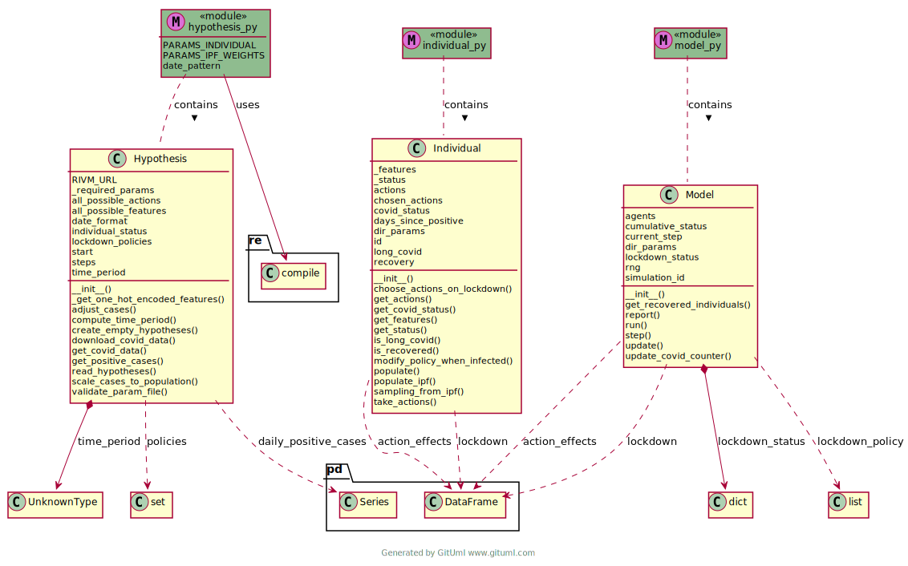

COMMA - **CO**\ vid **M**\ ental-health **M**\ odel with **A**\ gents
=====================================================================

.. container::

``comma`` lets you run agent-based simulations to study mental health
outcomes during covid-19 lockdowns.

Project status\ |image1|
========================

|Python package| |pages-build-deployment| |Docs| |Quality Gate Status|
|github license badge| |OpenSSF Best Practices|

Why?\ |image2|
==============

This project aims at understanding the full spectrum of impacts the
lockdown policies had during the COVID-19 pandemic, specifically on
non-COVID-19-related health outcomes, such as mental health. Although
lockdowns reduced disease transmission and mortality, they also
potentially exacerbated mental health issues. By using ``comma`` you can
simulate real-world scenarios, and estimate/compare the effects of
lockdown policies on the mental health of an a-priori defined population
across time.

Table of contents\ |image3|
===========================

-  `Motivation <#why>`__
-  `Installation <#installation>`__
-  `Example <#example>`__
-  `Diagram <#diagram>`__
-  `License <#license>`__
-  `Credits <#credits>`__

Installation\ |image4|
======================

Prerequisites
-------------

-  Python 3.6 or above

Install from source
-------------------

We recommend installing ``comma`` in a virtual environment. For example,
in conda:

.. code:: bash

   conda create --name comma_env
   conda activate comma_env

Then installing ``comma`` with ``pip`` by cloning the github repository
locally:

.. code:: bash

   git clone git@github.com:covid19ABM/comma.git
   cd comma
   python -m pip install .

That’s it! After following these steps, you should have ``comma``
installed in a dedicated virtual environment and be ready to use it.

.. container::

   [ ↑ Back to top ↑ ]

Example\ |image5|
=================

You can find a tutorial that demonstrates the usage of ``comma`` in the
``/notebooks`` folder.

.. container::

   [ ↑ Back to top ↑ ]

License\ |image6|
=================

``comma`` is under free open source `Apache License Version
2.0 <https://raw.githubusercontent.com/covid19ABM/comma/main/LICENSE>`__.
This means that you’re free to use, modify, and distribute this
software, even for commercial applications.

.. container::

   [ ↑ Back to top ↑ ]

Diagram\ |image7|
=================

   diagram

.. container::

   [ ↑ Back to top ↑ ]

Credits\ |image8|
=================

This is a project funded by the Netherlands eScience Center (Grant ID:
NLESC.SSI.2022b.022) and awarded to Dr Kristina Thompson (Wageningen
University) and developed in collaboration with the Netherlands eScience
Center. More information on the `Research Software
Directory <https://research-software-directory.org/projects/covid-19-mitigation-policies>`__.

.. |Python package| image:: https://github.com/covid19ABM/comma/actions/workflows/python-package.yml/badge.svg
   :target: https://github.com/covid19ABM/comma/actions/workflows/python-package.yml
.. |pages-build-deployment| image:: https://github.com/covid19ABM/comma/actions/workflows/pages/pages-build-deployment/badge.svg
   :target: https://github.com/covid19ABM/comma/actions/workflows/pages/pages-build-deployment
.. |Docs| image:: https://github.com/covid19ABM/comma/actions/workflows/documentation.yaml/badge.svg
   :target: https://github.com/covid19ABM/comma/actions/workflows/documentation.yaml
.. |Quality Gate Status| image:: https://sonarcloud.io/api/project_badges/measure?project=covid19ABM_comma&metric=alert_status
   :target: https://sonarcloud.io/summary/new_code?id=covid19ABM_comma
.. |github license badge| image:: https://img.shields.io/github/license/covid19ABM/comma
   :target: https://github.com/covid19ABM/comma
.. |OpenSSF Best Practices| image:: https://www.bestpractices.dev/projects/7777/badge
   :target: https://www.bestpractices.dev/projects/7777

